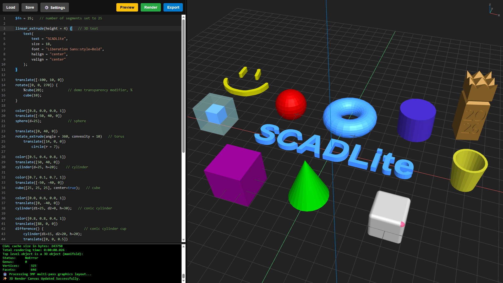

# SCADLite <a href="https://scadlite.com" target="_blank" rel="noopener noreferrer"><strong>scadlite.com</strong></a>

SCADLite is a lightweight, browser-optimized Progressive Web App (PWA) that pairs a feature-rich development workspace with a high-performance 3D viewport. It compiles and renders OpenSCAD geometry entirely client-side using WebAssembly (WASM) and functions 100% offline once installed. Write, preview, and iterate on 3D models instantly without local desktop installations. 

The core purpose of this project is to make OpenSCAD design fully accessible on web-based platforms, especially ChromeOS. OpenSCAD has tremendous potential in K-12 education, a domain currently dominated by Chromebooks in the United States. This app gives students and educators a zero-setup, privacy-first, free and open source, OpenSCAD design environment.

SCADLite can be accessed/installed by visiting **<a href="https://scadlite.com" target="_blank" rel="noopener noreferrer">scadlite.com</a>**

It can also be accessed/installed via GitHub Pages at **<a href="https://myoung8223.github.io/scadlite" target="_blank" rel="noopener noreferrer">https://myoung8223.github.io/scadlite</a>**

## Current Features

- **True Client-Side Compilation:** Leverages a browser-optimized WASM engine to compile `.scad` geometry on the fly with zero backend server dependencies.
- **External Library Support:** Upload zipped OpenSCAD libraries (MCAD, BOSL2, and the like) in Workspace Settings and use them exactly as you would on desktop—`include <MCAD/involute_gears.scad>` just works. Uploaded libraries persist in IndexedDB with their full directory structure preserved and are mounted into the WASM engine's virtual filesystem on every compile, keeping your source code 100% cross-compatible with desktop OpenSCAD.
- **App Files (In-App Project Storage):** Save `.scad` files to a built-in virtual project folder with **[Ctrl] + [S]** and reopen them with **[Ctrl] + [O]**—no filesystem round-trips required. Every stored file is also visible to the compiler, so files can reference each other via `include <myutils.scad>` / `use <parts.scad>`, enabling fully modular projects. A Download All option zips the whole folder for portable desktop use.
- **Full Backup & Restore:** One click backs up *everything* the app stores—App Files, libraries, custom fonts, STL/SVG imports, every setting, and the current editor contents—into a single timestamped zip. Restoring mirrors that backup back in (after a confirmation prompt), making SCADLite fully portable across machines, browser profiles, and reinstalls—especially handy on managed Chromebooks where profiles get wiped.
- **Smart Code Editor (CodeMirror 6):** A fluid text-editing interface built on a custom CodeMirror 6 bundle, equipped with real-time OpenSCAD syntax highlighting, toggleable bracket matching, toggleable active-line highlighting, and optional line numbers.
- **Multi-Line Block Indentation:** Standard `Tab` and `Shift + Tab` commands indent or outdent multiple lines of selected code simultaneously, powered by CodeMirror's native editing commands.
- **Code Folding (Brace & Comment-Based):** The editor's fold gutter collapses `{ ... }` blocks, and a custom comment-keyword fold lets you wrap any section between `// REGION` and `// ENDREGION` marker lines to collapse it on demand. The markers are ordinary comments, so they remain fully cross-compatible with desktop OpenSCAD.
- **Line-Faithful Error Checking:** A dedicated pre-pass evaluates your raw `.scad` code before the multi-pass preview runs, catching syntax, undefined-variable, and type errors and highlighting the exact offending editor line—because the check runs against unmodified code, reported line numbers map 1:1 to what you see.
- **Privacy-First Offline Architecture:** Built as an installable PWA that caches its entire runtime locally. Works completely offline with absolutely no network telemetry, data tracking, or cloud storage—your designs stay 100% your own.
- **Interactive Split-Pane Workspace:** Features a fully adjustable, draggable center divider to let you seamlessly balance your screen real estate between code writing and 3D visualization, plus a draggable console splitter for resizing terminal output.
- **Persistent Workspace Cache:** Automatically backs up your active script to `localStorage` on every keystroke, safely restoring your draft, project name, and layout configurations the exact millisecond you reload or reopen the application (governed by the Recover Last Workspaces setting). App Files, libraries, custom fonts, and STL/SVG imports persist separately in IndexedDB.
- **Link Sharing & Link Workspace:** An optional Link Sharing mode encodes your current model—and its project name—into a shareable URL and copies it to your clipboard, so a model can be opened by anyone simply by following the link. Enabling it adds a second, independent **Link Workspace** alongside the Main Workspace—received or shared models live there, keeping them separate from your primary work—and you can toggle between the two workspaces freely, each with its own project name. Received links can also be loaded from *inside* the app by pasting them into the Load menu—essential for the installed PWA, which has no address bar. *(Best suited to smaller models or demos, since URLs are length-limited; it is not intended as a primary save method.)*
- **Automatic Preview on Load:** Intelligently triggers an immediate 3D scene compilation upon loading any local `.scad` file or shared link, eliminating extra button clicks.
- **Perspective / Orthogonal Projection:** Toggle the 3D viewport between perspective and orthogonal projection—from the viewer toolbar or Workspace Settings—matching desktop OpenSCAD's view options. The choice persists across sessions, as does the Solid/Wireframe rendering mode.
- **Dedicated Workspace Settings Panel (⚙️):** Quick-access configuration options to change editor options, tune the 3D view (camera reset, zoom feel, projection, render mode, model color, grid and axes), manage fonts, STL/SVG imports, and libraries, back up and restore all app data, view third-party licenses, among other settings.
- **Streamlined Diagnostic Console:** A real-time terminal UI stripped of misleading native engine filesystem warnings, focusing on compilation and rendering information, and syntax errors. An optional debug toggle surfaces the verbose intermediate code emitted by each modifier pass.
- **Native Color & Modifier Support:** Bypasses legacy monochromatic pipelines by rendering directly to the 3MF specification. The viewport natively respects script-defined `color()` functions, custom RGB configurations, and transparency. It introduces a custom multi-pass pre-parsing layer to isolate design modifiers—rendering ghost geometry (`%`) as translucent smoky glass (pale cyan) and highlights (`#`) as a glowing semi-transparent red alert mesh. *(Note: While robust for standard structures, the experimental parsing engine may diverge slightly from native desktop OpenSCAD behavior during deeply nested combinations of ghost `%` and highlight `#` modifiers.)*

## Improvements and Features to Add

- [x] **Library Support:** Upload zipped external libraries in Workspace Settings; they persist locally and mount into the engine's virtual filesystem with directory structure intact, so `include <MCAD/...>` / `use <...>` resolve exactly as on desktop.
- [x] **App Files (In-App Storage):** Save and open `.scad` files inside the app itself, with stored files mountable via `include`/`use` for modular projects, plus a Download All zip export.
- [x] **Backup & Restore:** Export all app data—files, libraries, fonts, imports, and settings—to a single zip, and restore it wholesale on any machine or profile.
- [x] **In-App Shared Link Loading:** Paste a received share link into the Load menu (or Workspace Settings) to open it without touching the address bar—making link sharing fully usable inside the installed PWA.
- [x] **Per-Workspace Project Names:** The Main and Link workspaces each keep their own project name, and shared links carry the name along with the model.
- [x] **STL Importing:** Allow users to import STL files into the PWA and then import them into projects.
- [x] **SVG Importing:** Allow users to import SVG files into the PWA and then import them into projects.
- [x] **3MF Exporting:** Allow users to toggle between exporting to 3MF or STL.
- [x] **Custom Fonts:** Allow users to import TTF files into the PWA and then use them into projects.
- [x] **Adjustable Axes and Grid:** Toggleable grid and axes with configurable step, range, tick mark size, and tick style.
- [x] **Replace textarea with a syntax-highlighting editor:** Migrated the editing surface to a custom CodeMirror 6 bundle for syntax highlighting, bracket matching, and structural editing.
- [x] **Code Folding:** Collapse `{ ... }` brace blocks via the editor's fold gutter, plus custom `// REGION` / `// ENDREGION` comment-based folding for hiding sections.
- [x] **Link Sharing & Link Workspace:** Encode the current model into a shareable URL, with a dedicated secondary Link Workspace that keeps shared/received models separate from primary work.
- [x] **Improve 3D Lighting and Model Texturing:** Right now the lighting needs improvement and texturing the models would improve the preview.
- [ ] **Camera Movement Improvements:** Improve the camera movement, perhaps with translation acceleration. (Zoom intensity and smoothness are now tunable in Workspace Settings.)
- [x] **Orthogonal Projection:** Toggle between perspective and orthogonal 3D projection, from the viewer toolbar or Workspace Settings, with the choice persisted across sessions.
- [x] **Add Support for Color:** Render script-defined `color()`, custom RGB, and alpha transparency natively via the 3MF pipeline.
- [x] **Improve Error Highlighting:** While there's basic error highlighting now, that should be refined further.
- [x] **Adjustable Editor/Preview Port Framing:** An adjustable, and persistent editor/preview port framing is needed.
- [x] **Add Optional Line Numbers:** Optional line numbers in the editor would be a welcome feature.
- [x] **Add a Settings Menu:** Add a settings menu to declutter the core interface.
- [x] **Project Name Field:** Add a project name field so saved .scad files will have that for the filename.
- [x] **Adjustable Editor Font Size:** An adjustable, and persistent font size for the editor would be welcome.
- [x] **Address Editor Word Wrap:** Word wrap needs to be disabled or made to be a configurable setting.
- [x] **Toggle for Console:** Add a toggle to hide/show the console.
- [x] **Help Button:** Add a Help button for communicating basic use and app information.
- [x] **Link to OpenSCAD Cheat Sheet:** The ability to pop-up the super handy OpenSCAD cheat sheet would be a nice feature to add.
- [x] **Improve PWA Icon:** The icon is a little dark. It could use a snazzier icon.
- [x] **F5 to Preview:** Press F5 key to quickly initiate a preview, just like in OpenSCAD.  Message overlay indicating preview build in progress.
- [x] **Native Color & Material Support via 3MF:** Replace the legacy single-color `scad2stl` pipeline entirely, and shift output targets to the **3MF (3D Manufacturing Format)** specification to natively export color, multi-material, and geometry metadata directly from the WebAssembly core.
- [x] **Client-Side Archive Extraction (`fflate` + `ThreeMFLoader`):** Implement an in-memory zip-decompression layer that bridges `fflate` with the Three.js 3MF loader, allowing zipped 3MF models to be unpacked and loaded seamlessly on the fly with zero backend overhead.
- [x] **Dynamic Alpha Transparency & Shading:** Program a smart material processing engine that scans compiled vertex paths to honor script-defined opacity (`alpha` values), configure overlapping face transparency passes, and fall back gracefully to global workspace theme selections if no structural color is declared.
- [x] **Multi-Pass Modifier Shading Layer:** Capitalize on the new color pipeline to support advanced OpenSCAD design modifiers, adding script token pre-parsing that targets and renders ghost geometry (`%`) as translucent smoky glass (pale cyan) and highlights (`#`) as a glowing semi-transparent red alert mesh.

## Getting Started

### 🚀 Offline PWA & Data Privacy

This application is built as a fully standalone **Progressive Web App (PWA)**. 

- **App Installation:** You can install this editor directly to your device as a native-feeling application. Simply click the "Install" icon in your web browser's address bar (Chrome, Edge, Brave) or select "Add to Home Screen" (Safari/Mobile).
- **100% Offline Capable:** Once loaded or installed, the application utilizes a Service Worker to cache all necessary engine files, typography, and libraries. It can be launched and operated completely offline without an active internet connection.
- **Strict Data Privacy:** There are no backend servers, no cloud storage, and no telemetry. Every single keystroke, compilation, and export happens entirely client-side within your browser's local sandbox. Absolutely **zero** data is ever transmitted over the network, ensuring complete intellectual property protection and data privacy.

### Local Setup & Initialization

Whether installed as a PWA or loaded in the browser, the execution sequence initiates automatically upon boot:

1. **Environment Verification:** Outputs build configurations and instantiates the virtual WebAssembly (WASM) sandboxed engine.
2. **Workspace Seeding:** Initializes the CodeMirror 6 editor environment and automatically restores your previous session's code cache and project name. If no previous session is found, it seeds a simple default starter geometry.
3. **Resource Provisioning:** Fetches and mounts required typography packages directly into the virtual memory filesystem, then restores any custom fonts, STLs, SVGs, App Files, and uploaded libraries from local storage before unlocking the compiler controls.
4. **Viewport Initialization:** Boots the WebGL/Three.js 3D workspace in the background so the camera, responsive grid, and lighting matrices are ready the moment the first compile finishes.

### Basic Use

- **Saving & Opening (App Files):** Click the **Save** button or press **[Ctrl] + [S]** to save the current code to **App Files**, the app's built-in project storage (Save As when untitled). Click the **App Files** button or press **[Ctrl] + [O]** to open a stored file. Files in App Files can `include`/`use` each other for modular projects, and a **Download All** option zips the whole folder to your machine.
- **Loading & Downloading (Disk):** Click the **Load** button to bring a `.scad` file in from your computer (when Link Sharing is enabled, Load instead opens a small menu offering either a disk load or a shared-link paste). Click **Download** to write the editor's current code out to a `.scad` file on your machine.
- **Smart Code Editor:** The workspace features intelligent formatting. Press `Tab` or `Shift + Tab` to quickly indent or outdent multi-line blocks of code. The editor also features real-time syntax highlighting, toggleable bracket matching, and will automatically highlight the exact line of code if the compiler encounters a syntax error.
- **Code Folding:** Use the fold arrows in the editor's gutter to collapse `{ ... }` blocks. You can also wrap any block of code between a `// REGION` line and a `// ENDREGION` line to make that whole section foldable. Because the markers are plain comments, code using them still runs unchanged in desktop OpenSCAD.
- **Previewing:** Click the **Preview** button, press **[F5]**, or use the **[Ctrl] + [Enter]** hotkey combo to compile your `.scad` code into a fast 3D preview in the right pane. A line-faithful error pre-pass runs first; if your code has a hard error, the preview halts and highlights the offending line. Otherwise the custom multi-pass compilation layer maps OpenSCAD design modifiers, rendering ghost geometry (`%`) as translucent smoky glass and highlights (`#`) as a red alert mesh.
- **Rendering:** Click the **Render** button or press **[F6]** to perform a formal, single-pass evaluation of your code. This computes a finalized solid geometry representation: elements marked with the ghost modifier (`%`) are completely ignored, and components with the highlight modifier (`#`) are processed as standard solid elements, preparing the workspace for a clean manufacturing export.
- **Exporting:** Click the **Export** button or press **[F7]** to convert the currently rendered geometry into an `.stl` or `.3mf` file (selectable via the Export Format setting) and stream it straight to your local downloads folder. The exporter reorients the mesh back to OpenSCAD's native Z-up coordinate system so the result drops cleanly into 3D slicing software.
- **Using Libraries:** Upload zipped OpenSCAD libraries in Workspace Settings › Libraries. Name the zip after the library's canonical folder (e.g. `MCAD.zip`), and reference it in code exactly as on desktop: `include <MCAD/involute_gears.scad>`.
- **Link Sharing & Workspaces:** Enable **Link Sharing** in Workspace Settings to unlock a second **Link Workspace** and a set of link controls in the toolbar. Use **Update Link** to encode your current model—and its project name—into a URL and copy it to your clipboard, and **Switch Workspace** to toggle between the Main and Link workspaces (each keeps its own project name; a small label above the filename in the 3D view shows which workspace you're in). Opening a URL that contains an encoded model loads it into the Link Workspace (overwriting whatever was there), as does pasting a received link into the Load menu or the **Load Shared Link** button in Workspace Settings—the in-app route to open links when running as an installed PWA. A few things to keep in mind: URLs are length-limited, so link sharing is best for smaller models or demos rather than as a save method; and sharing a link while the Main Workspace is selected will copy the Main Workspace's code into the Link Workspace. If you run multiple instances/tabs at once, note that both workspaces are shared, global storage rather than per-instance—so save important work to App Files or a `.scad` file rather than relying on the cache to hold multiple versions.
- **3D Viewport & Display:**
  - Click the **Solid / Wireframe** button to toggle the mesh rendering mode, and the **Perspective / Orthogonal** button to toggle the camera projection—both persist across sessions.
  - Click the **Change (Color)** button (the color swatch) to open the native color picker and dynamically change the 3D model's material color.
  - You can drag the center gutter left or right to seamlessly adjust the width between the code editor and the 3D viewport.
- **Workspace Settings (⚙️):** Click the Settings icon or press **[Ctrl] + [,]** to access Workspace Settings. Press **[F1]** to toggle the Help / OpenSCAD cheat-sheet overlay. Settings include:
  - **Project Name:** Name your work—it becomes the filename for saves, downloads, and exports, and displays in the 3D view.
  - **Editor Font Size:** Scale the code text up or down for readability.
  - **Toggle Line Numbers:** Show or hide the left-hand line number gutter.
  - **Toggle Bracket Matching:** Enable or disable bi-directional bracket matching.
  - **Toggle Active-Line Highlighting:** Enable or disable highlighting of the current editor line.
  - **Toggle Console / Console Debug:** Show or hide the terminal output box, and optionally surface the verbose intermediate code emitted by each modifier pass.
  - **Grid & Axes:** Toggle the reference grid and axes, with configurable step, range, tick mark size, and tick style.
  - **Reset Camera & Zoom Settings:** Instantly frame the 3D viewport camera to the current model's bounds, and tune zoom intensity and smoothness.
  - **Model View:** Toggle Perspective/Orthogonal projection and Solid/Wireframe rendering—both remembered across sessions.
  - **Model Color:** Pick the model's material color; the button doubles as a live swatch of the current selection.
  - **Export Format:** Switch exports between STL and 3MF.
  - **Manage Custom Fonts:** Add custom fonts for use in models.
  - **Manage STL Imports:** Import STL files for use in models. Note that STL files must be ASCII format, not binary format.
  - **Manage SVG Imports:** Add SVG files for use in models.
  - **Manage Libraries:** Upload zipped OpenSCAD libraries for `include`/`use` in models.
  - **Backup All Data / Restore Backup:** Export everything the app stores to a single zip, or mirror a backup back in (restore replaces all current data, with a confirmation prompt).
  - **Link Sharing & Load Shared Link:** Enable or disable Link Sharing and the secondary Link Workspace, and load a received share link from inside the app.
  - **Recover Last Workspaces:** Choose whether editor contents and project names are restored on the next session.
  - **View Licenses:** Read the full third-party open-source license and credits notice.

### Compatibility Notes

- **STL import format:** Imported STL files must be in **ASCII** format; binary STLs are not supported. OpenSCAD can export ASCII STLs via *Preferences › Advanced › Export Features* (note that ASCII STLs are considerably larger than binary).
- **External libraries:** `include <...>` / `use <...>` of external libraries **are supported** via Workspace Settings › Libraries. Upload the library as a zip named after its canonical folder name—for example, the MCAD library should be uploaded as `MCAD.zip` (containing the library's files, or a folder containing them; GitHub-style `-master`/`-main` suffixes are stripped automatically). Directory structure is preserved, so `include <MCAD/involute_gears.scad>` resolves exactly as it does in desktop OpenSCAD, keeping your source 100% cross-compatible. The older workaround of manually inlining library code (collapsible via `// REGION` / `// ENDREGION` folding) still works but is no longer necessary.

## Built With

- **WebAssembly (WASM)** - High-performance port of the native OpenSCAD engine.
- **Vanilla JavaScript, HTML5, & CSS3** - Lightweight PWA architecture optimized for offline use and instant paints.
- **Three.js** - High-performance WebGL graphics pipeline used to render the live 3D viewports and handle interactive camera manipulations.
- **CodeMirror 6** - The extensible editor framework powering in-browser code editing, syntax highlighting, bracket matching, code folding, and structural indentation, bundled from the `@codemirror/*` packages (view, state, commands, language, search, autocomplete, lint) and `@lezer/highlight`.
- **fflate** - High-speed, ultra-lightweight compression module for unzipping 3MF data packages, ingesting library archives, and building backup and Download All zips entirely in memory.
- **Liberation Fonts** - Open-source typeface families mounted directly into the application's virtual memory layout for 3D text configurations.

## Credits & Contributions

- **Mike Young** — Lead Architect & Creator.
- **Gemini (Flash, Thinking, & Pro)** — AI Engineering Assistant, Code Optimization, & Regex Architecture.
- **Claude** — Additional AI Engineering Assistant, instrumental in the migration toward multi-pass rendering.
- **[OpenSCAD WASM](https://github.com/openscad/openscad-wasm)** — The official, sandboxed WebAssembly port translating functional CAD code into raw geometries entirely client-side.
- **[Three.js (mrdoob)](https://github.com/mrdoob/three.js)** — Created by Ricardo Cabello (mrdoob), providing the high-performance WebGL 3D graphics pipeline, along with the essential `ThreeMFLoader`, `STLExporter`, and `OrbitControls` companion modules.
- **[CodeMirror (Marijn Haverbeke and others)](https://codemirror.net/)** — An extensible code editor component for the web, driving the application's core text editing, syntax highlighting, bracket matching, code folding, and multi-line formatting engine.
- **[fflate (Arjun Barrett)](https://github.com/101arrowz/fflate)** — A high-performance, ultra-lightweight compression library utilized in-memory to synchronously extract compiled 3MF web archive packages for the rendering viewport.
- **[Liberation Fonts (Red Hat / Liberation Project)](https://github.com/liberationfonts/liberation-fonts)** — A set of metric-compatible, open-source font families (Sans, Serif, and Mono) embedded into the WebAssembly memory filesystem to provide out-of-the-box structural text generation capabilities.

## License

This project is licensed under the **GNU General Public License v2.0 (GPL-2.0)** - see the [LICENSE](LICENSE) file for details. This license is required due to the upstream dependency on the GPL-licensed OpenSCAD WebAssembly engine.
